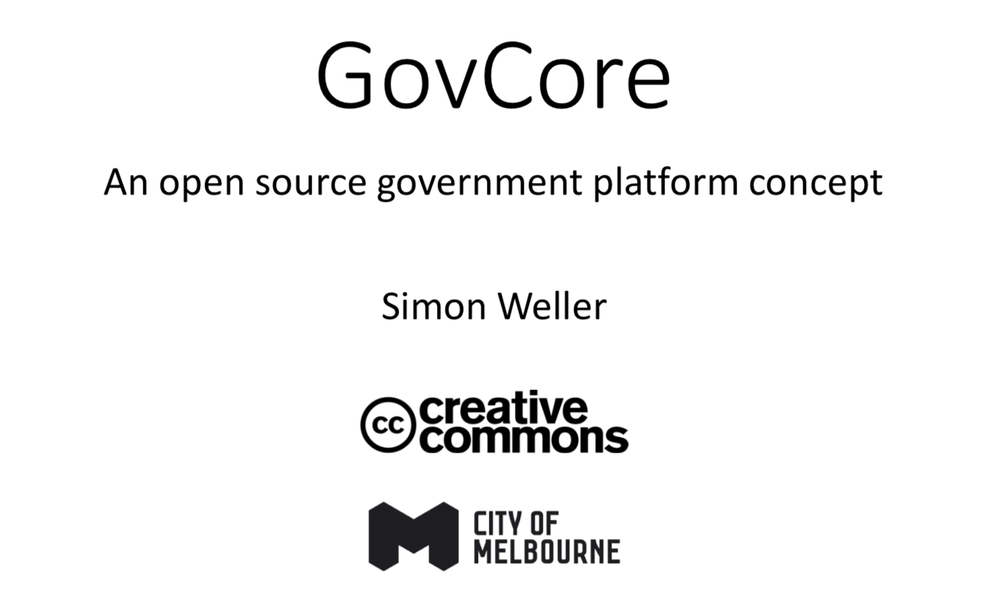

TODO: Introduce GovCore briefly then link to the [GovCore Concept](docs/govcore.md)

TODO: First attempt towards GovCore...GovAuth as a client to demonstrate GovCore

TODO: Write about the specific of this chunk of the project (CoM <-> CodeForAustralia) (Fellowship)

TODO: Hypothesis: By Lifting business data rules to versioned templates....

## TODO: Spec (Blueprint)

Define the GovCore Way...

The [GovCore Concept](docs/govcore.md) sets the Vision/Goals. We need to go down one level and specify the concept in more detail. We need to include enough information to able to implement GovCore in any platform/database/language.

## Implementation

TODO: Review focus on GovCore/GovAuth

- [GovAuth Graphql Templates](docs/govauth-graphql-templates.md)
- [GovAuth Model](docs/govauth-model.md)
- [GraphQL](docs/graphQL.md)
- [Graphs](docs/graphs.md)
- [Model Representation](docs/model-representation.md)
- [Template Representation](docs/template-representation.md)
- [Template Validation](docs/template-validation.md)
- [Basic Operations](docs/basic-operations.md)

## Code

TODO: Diagram of current architecture GovAuth <-> GovCore

TODO: What was built govcore, govauth, govbox

TODO: How far we got (feature list checklist)

TODO: What's next?

## Roadmap

TODO: review focus on GovCore

- [x] Model of GovAuth
- [x] Research and Implement model using a readable format (Json)
- [x] Prototype for GovAuth(Just Wireframes)
- [x] Bridging Gov Auth single application with GovCore API through graphQL
- [x] Enabling Gov Auth API playground through graphQL
- [ ] Increasing GovCore logic Layer (Template validation, enforcing rules, making template availables)  👈 doing
